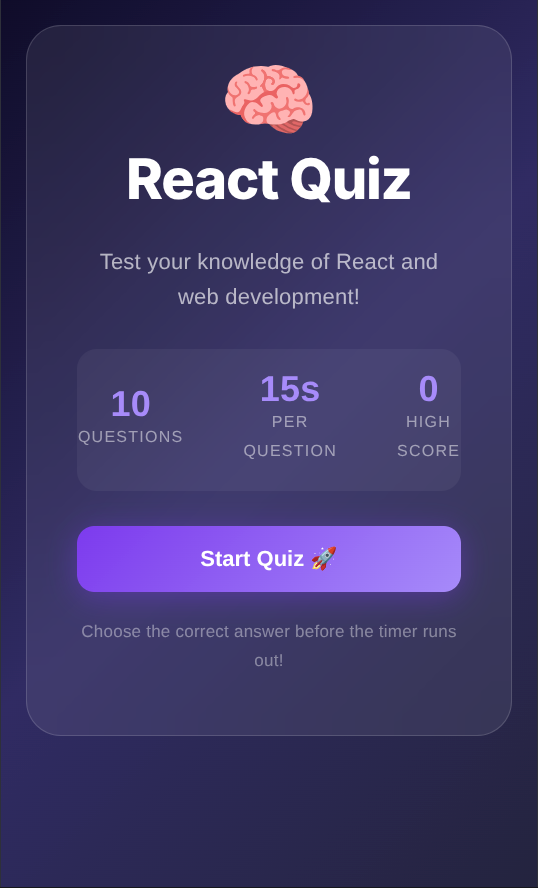
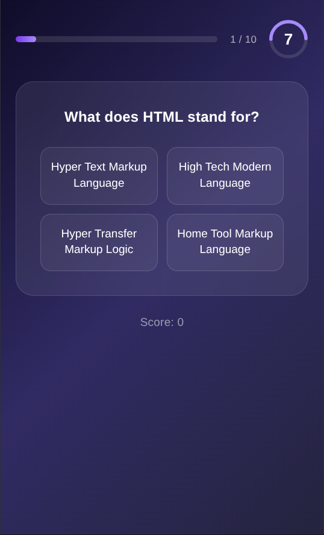

# React Quiz App

A polished, interactive quiz experience built with React and Vite. This project presents a set of web-development questions with a countdown timer, a live progress bar, and persistent high-score tracking.

## ✨ Features

- Clean landing screen with quiz overview and high-score display
- 10 timed questions covering HTML, CSS, JavaScript, React, and web tooling
- Countdown timer with urgency states as time runs out
- Real-time score updates and progress tracking
- High score persistence using local storage
- Smooth navigation between the home, quiz, and results flow

## 📸 Screenshots

### Home screen


### Quiz experience


## 🛠️ Tech Stack

- React
- React Router DOM
- Vite
- CSS
- Local storage for score persistence

## ▶️ Getting Started

1. Install dependencies:
   ```bash
   npm install
   ```
2. Start the development server:
   ```bash
   npm run dev
   ```
3. Open the local URL shown in the terminal (usually http://localhost:5173/)

## 🧪 Build

To create a production build:

```bash
npm run build
```

## 📁 Project Structure

- `src/` — application source code
- `src/pages/` — home, quiz, and results pages
- `src/components/` — reusable UI pieces such as the timer and progress bar
- `src/context/` — quiz state management via React context
- `src/data/` — quiz questions and answers

## 💡 Notes

This project is a front-end learning app focused on building a simple, engaging quiz experience with React. It is a great starting point for anyone who wants to explore routing, state management, timers, and polished UI patterns.
